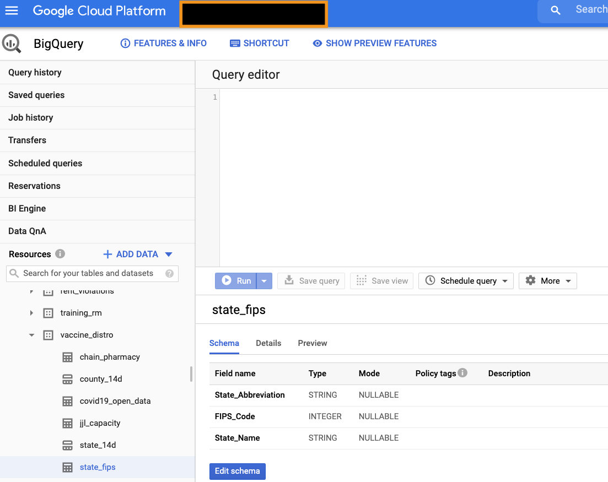

# Google Global Public Sector - Looker ML for Vaccine Distribution

Contributors/Owners:
Joseph Lei/Karteek Kotamsetty/Mike Snodgrass/Ranadheer Mettu/Peter Fisher

High Level Overview
1. Create GCP Account
2. Create a GCS - Storage Bucket 
3. Upload the vaccine distro CSVs to the GCS Storage Bucket
4. Create GCP BigQuery DataSet vaccine_distro
5. Import CSVs into BiqQuery Data Set vaccine_distro
6. Test and Confirm Data was loaded
7. Create Looker Instance, and Account, Define Looker Connection to BigQuery, Create Looker Service Account
8. Clone vaccine_distro repo into your Looker Instance
9. Create reports and dashboards with your vaccine_distro LookML

Once you have your GCP Account, navigate to Google Cloud Storage and create a storage bucket that will hold our CSV data files.

 
 
Once you have created your storage bucket, you can upload the CSV data files for this demo. The CSVs are small and can be downloaded here:

 
 
You can load the 6 csv's files using the upload files button. Here is a screenshot of what your bucket should look like after uploading the csv files.

 
 

Next, we are going to use Google's BigQuery as our database. 
We are going to create a data set, and then upload the CSV files using the Upload Wizard in BigQuery.

 
 

Step 1 - Create BigQuery Data Set

 
 

Step 2a - Create BigQuery Tables from CSV

 
 

Step 2b - Load CSV into BigQuery Table

 
 

Step 2c - Get the location for the CSV file. Where to find the GS URI location from Google Cloud Storage

 
 

Step 2d - Create Table Wizard Completed. Note, that table name, auto-detect schema, and skip header row fields were either marked or entered.
(*Note: It is best if you create the table using the same name as the CSV file wihout the .csv. As example, the chain_pharmacy.csv we would create a table chain_pharmacy. We will repeat this process for each of the csv files)

 
 

Step 2e - Hit Create Table, and a data load job will start. Once the job is complete, you should see the chain_pharmacy under your vaccine_distro dataset in BigQuery. You can confirm that the data is loading by previewing the data.

 
 

Repeat for each CSV file Steps 2a through 2e to load the data into BigQuery.

 
 

You should have 6 tables:  chain_pharmacy, county_14d, covid19_open_data, jjl_capacity, state_14d, state_fips in your vaccine_distro dataset, similar to the screenshot below.

 
 

## LOOKER DEMO - STEP 1 CONNECTIONS
First, let's go to our Looker instance and set up a connection to BigQuery.

Under the Looker Admin Menu - You find Database - Connections

Open Connections

Let’s show how a user could create a new connection and let’s highlight the breath of database connections that Looker supports. 

Here where you would define a connection to BigQuery. 
Notice the BigQuery Connector and the broad support for other databases.

Looker supports a wide range of SQL database dialects and will continue to improve the feature implementations for existing dialect options as well as add new dialects. Because our modeling layer, LookML, builds on top of the in-database features available, some dialects allow for a more powerful implementation than others. More Info - https://docs.looker.com/setup-and-management/database-config

Here are the instructions on how to connect Looker to your BigQuery DataSet: 
https://docs.looker.com/setup-and-management/database-config/google-bigquery

The general steps for setting up a Google BigQuery Standard SQL or Google BigQuery Legacy SQL connection are:

1. Create a service account with access to the Google project and download the JSON credentials certificate.
2. Create a temporary dataset for storing persistent derived tables.
3. Set up the Looker connection to your database.
4. Test the connection.

***This is not an officially supported Google product***

